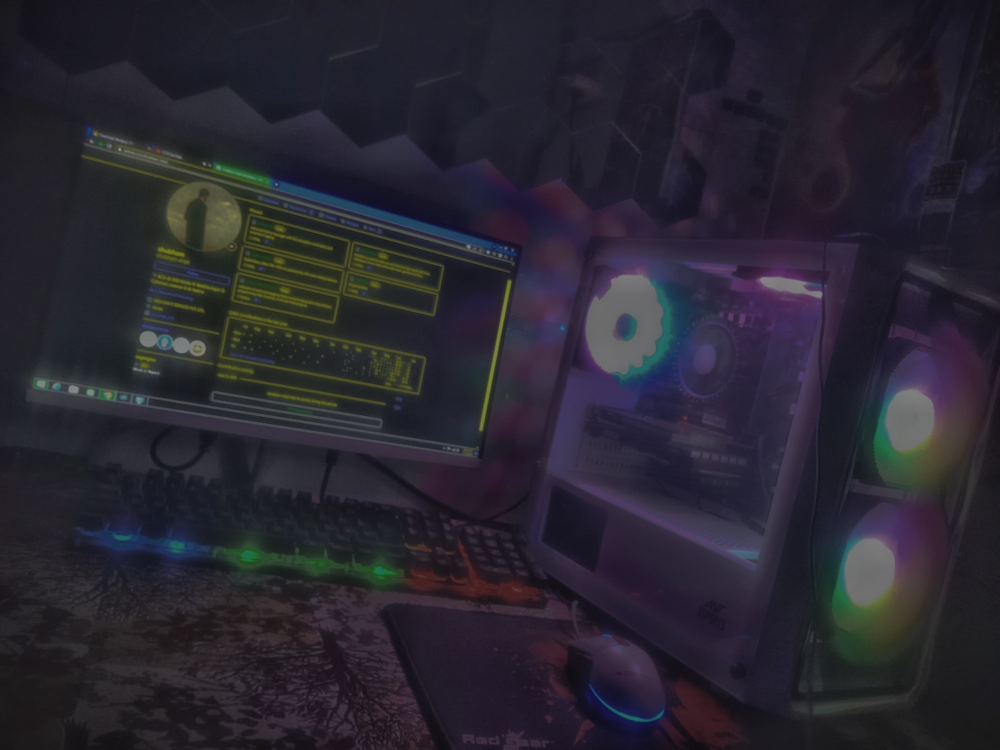

</img>

</div>
<p align="center">
  <a href="https://github.com/DenverCoder1/readme-typing-svg">
    
  </a>
</p>

  <p align="center">

</p>
<p align="center">
  
  
  
  
</p>
<div align="center">
  
</div>
<p align="center" style="margin-top:18px;">

</p>
<p align="center">
  
  
  
  
  
  
  
  
  
  
</p>
<div align="center">
  
</div>

<p align="center" style="margin-top:18px;">
 
</p>
<p align="center">
  
  
  
  
  
  
  
  
  
</p>
<div align="center">
  
</div>

<p align="center" style="margin-top:18px;">

</p>
<p align="center">
  
  
  
  
  
  
  
  
  
  
  
  
</p>


</div>

<div align="center">
  
</div>

<div align="center">
  
</div>

<div align="center">
  
</div>

<div align="center">
  
</div>

<div align="center">
  
</div>

```bash
$ whoami
> shubham@shipt:~$ Cybersecurity Enthusiast | Web Developer | Passionate about Coding & Hacking

$ ./skills.sh --list-top
> [Loaded]: C/C++ | Python | JavaScript | Social Engineering | Web Development | Linux

$ shubham -a
> OS: Kali Linux (amd64) | Alias: CyberOS

$ ps aux | grep active-projects
> ACTIVE: Cyber-Library | Portfolio | Python-Mini-Projects | Keylog-v6

$ cat /etc/address | grep contact
> Location: Noida | Email: shubscript213@gmail.com
```
<div align="center">
  
</div>

<p align="center">
  
</p>

<div align="center">
  
</div>

## 🦾 About Me

Hi, I'm <b style="color:#A259FF;font-family:'Space Grotesk', 'Fira Code', monospace;">Shubham</b>.<br>
I'm learning web development and exploring cybersecurity. I enjoy coding, trying ethical hacking tools, and building small projects as I improve my skills step by step.

- 🛡️ **Focus:** Ethical hacking, web development, cybersecurity fundamentals  
- 🔬 **Interests:** Penetration testing, web security, CTF competitions, cloud security  
- 💻 **Skills:** C/C++, Python, JavaScript, HTML/CSS, Web Development, Linux, Bash, GitHub, Git  
- 🌐 **Communities:** Active in cybersecurity forums and open-source projects  
- 🎓 **Learning:** Advancing in hacking, network security, and secure coding practices

My mission is to become a <span style="color:#B98CFC;font-weight:bold">Hacker</span>.

<div align="center">
  
</div>

## 🔒 C++ Code Example

```cpp
#include <iostream>
const std::string RED   = "\033[1;31m";
const std::string BLUE  = "\033[1;34m";
const std::string PURPLE= "\033[1;35m";
const std::string RESET = "\033[0m";
int main() {
    std::cout << RED   << "  ____   " << BLUE << "__  __ \n"
              << RED   << " / __ \\  " << BLUE << "|  \\/  |\n"
              << RED   << "| |  | | " << BLUE << "| \\  / |\n"
              << RED   << "| |  | | " << BLUE << "| |\\/| |\n"
              << RED   << "| |__| | " << BLUE << "| |  | |\n"
              << RED   << " \\____/  " << BLUE << "|_|  |_|\n"
              << PURPLE << "\n         ~ OM ~\n"
              << RESET;
    return 0;
}
```

<div align="center">
  
</div>

## 🛠️ Technical Arsenal

<p align="center" style="font-family: 'Space Grotesk', 'Fira Code', 'JetBrains Mono', monospace;">
  
  
  
  
  
  
  
 
</p>

<div align="center">
  
  <div align="center">
  
</div>
</div>

### 🌐 Web Development Stack

<p align="center">
  
  
  
  
  
  
  
  
  
</p>


<div align="center">
  
</div>

<div align="center">
  
</div>

## 🖥️ Security Operations Environment

<p align="center" style="font-family: 'Space Grotesk', 'Fira Code', monospace;">
  
  
  
  

</p>

<div align="center">
  
</div>
<div align="center">
  
</div>

## 🚀 Projects


<div align="center" style="display: flex; flex-wrap: wrap; gap: 20px; justify-content: center;">
  <a href="https://github.com/shubham-shipt/keylog-v12">
    
  </a>
  <a href="https://github.com/shubham-shipt/Python-Mini-Projects">
    
  </a>
  <a href="https://github.com/shubham-shipt/cs2-mvp-autochat">
    
  </a>
  <a href="https://github.com/shubham-shipt/DailyDesk">
    
  </a>
  <a href="https://github.com/shubham-shipt/Cyber-Library">
    
  </a>
  <a href="https://github.com/shubham-shipt/Kali-Wall.sh">
    
  </a>
  <a href="https://github.com/shubham-shipt/Shineword">
    
  </a>
</div>

<div align="center">
  
</div>

## 📊 Analytics Dashboard

<p align="center">
  
  
</p>

<p align="center">
  
</p>

<div align="center">
  
  
</div>

<div align="center">
  
  
</div>

<div align="center">
  <a href="https://github.com/shubham-shipt">
    
  </a>
</div>

<div align="center">
  
</div>


<div align="center">
  
</div>

<div align="center">
  

<div align="center">
  
</div>

## 💭

<div align="center">
  
</div>
<div align="center">
  
</div>

  "Just Doing"
</blockquote>


<div align="center">
  
</div>
<div align="center">
  
</div>

## 🌐 Professional Network

<div align="center">
  <a href="https://www.instagram.com/om_singh_213" target="_blank" title="Instagram">
    
  </a>
  <a href="https://github.com/shubham-shipt" target="_blank" title="GitHub">
    
  </a>
  <a href="https://leetcode.com/shubham_shipt" target="_blank" title="LeetCode">
    
  </a>
  <a href="mailto:shubscript213@gmail.com" target="_blank" title="Email">
    
  </a>
</div>


<div align="center">
  
</div>

<div align="center">
  <h3>
    <span style="color:#A259FF">
      01001001 00100000 01100001 01101101 00100000 01010011 01101000 01110101 01100010 01101000 01100001 01101101 00100000 01100001 01101110 01100100 00100000 01001111 01101101
    </span>
  </h3>
</div>

<div align="center">
  <h3 style="font-family: 'Devanagari MT', serif; color:#A259FF;">
    शुभम्,
  </h3>
</div>


</img>

